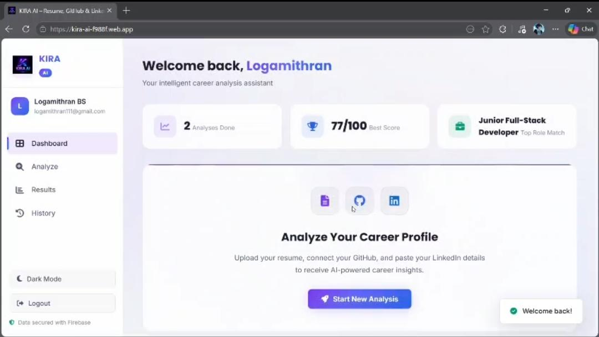
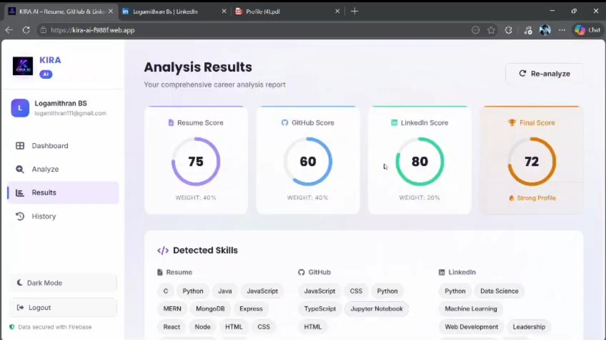
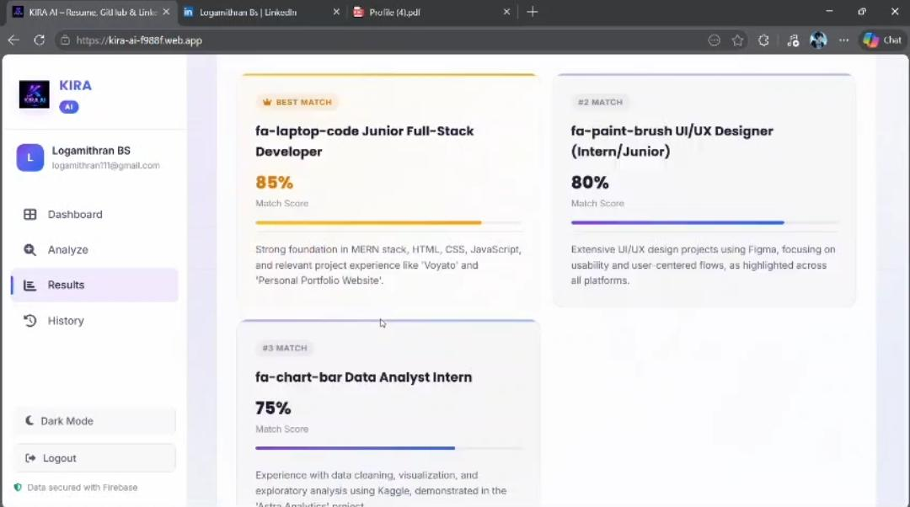

# 🤖 KIRA-AI

KIRA-AI is an AI-powered profile analysis and recommendation platform that evaluates user information to generate personalized insights and smart career suggestions. Built using modern web technologies and Firebase cloud services, it helps users make informed decisions through intelligent data analysis.

## ✨ Features

- AI-Based Profile Analysis
- Personalized Recommendations
- Smart Career Suggestions
- Real-Time Data Processing
- Firebase Cloud Integration
- Responsive User Interface

## 🛠️ Tech Stack

- HTML5
- CSS3
- JavaScript
- Firebase
- Git & GitHub

## 📸 Screenshots

### Home Page

### Profile Analysis

### Recommendation Results

# Developed By 😊

Logamithran BS
